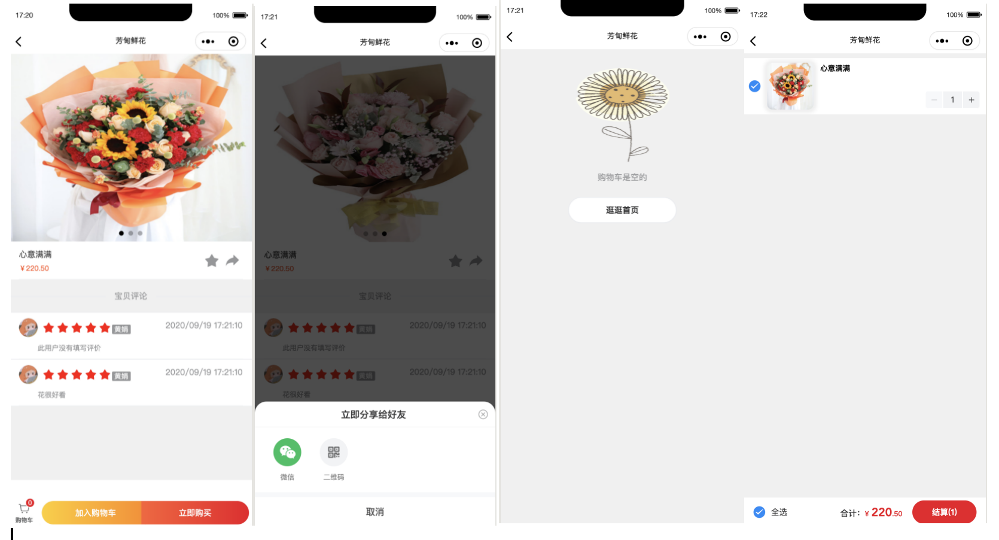
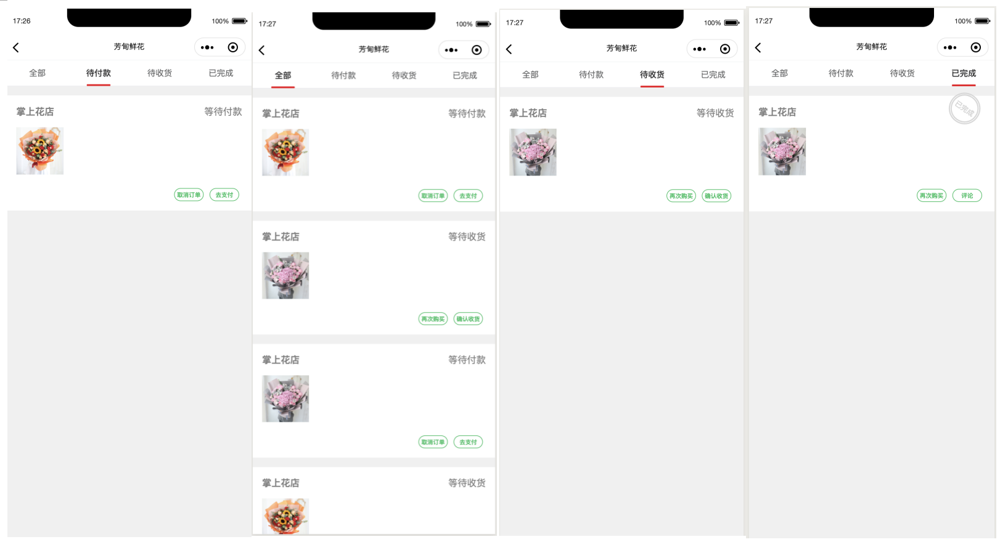
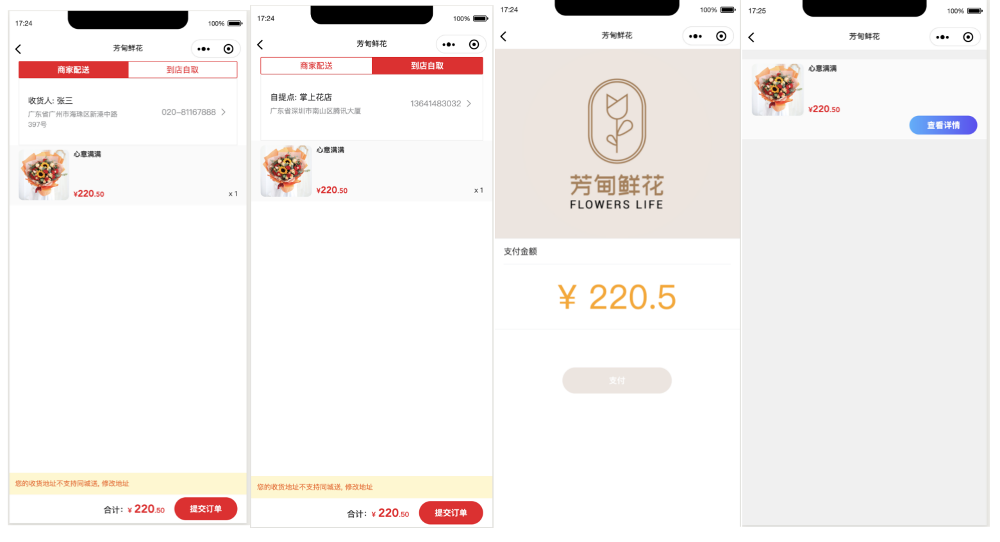
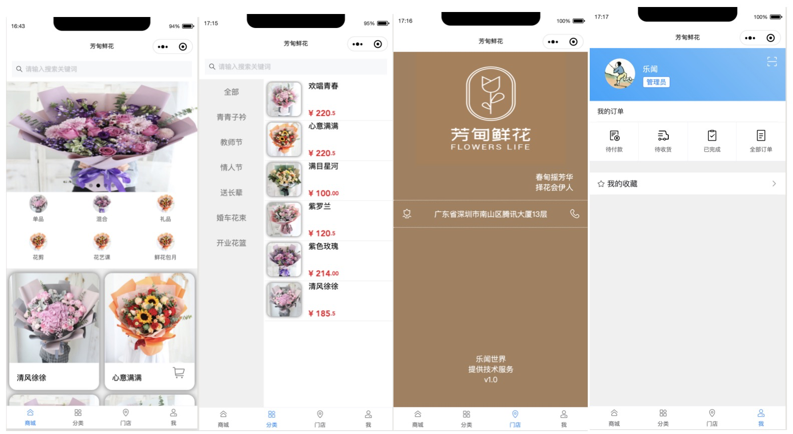
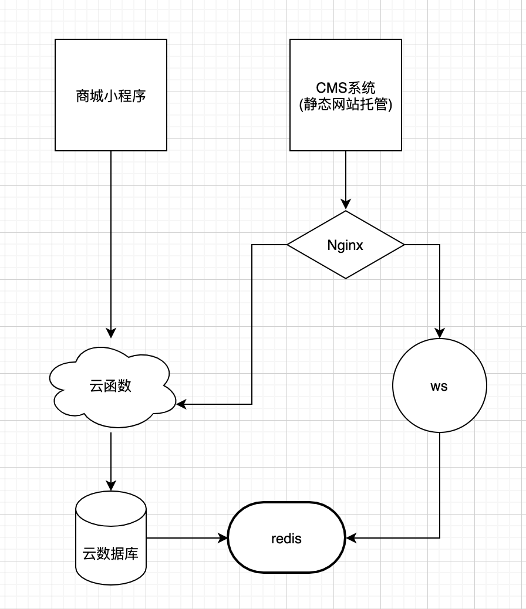
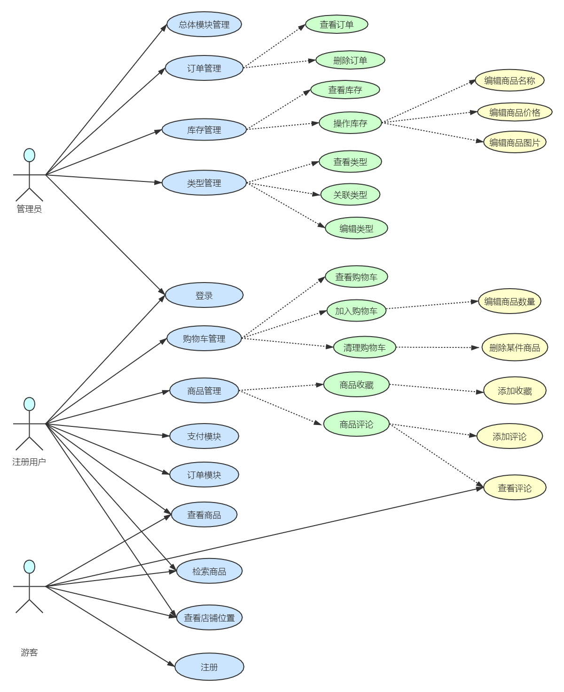

# 芳甸鲜花商城

### 应用介绍 

芳甸鲜花是一个服务独立商户的内容完全可配置的商城微信小程序。满足个体商户拥有自己的商城App,以及开发者可以快速的完成接入，完成客户的需求。本项目的宗旨就是快好省（开发快，效果好，资源省）。

### 目标用户

独立商户，小程序开发者

### 主要功能

微信小程序

1. 商品列表，商品详情。用户可以选择喜欢的商品进行下单购买，查看商品的详情介绍
2. 购物车。购物车是所有商城必备的一个功能，用户将喜欢的商品加入购物车，在购物车里可以看到选购的商品，选择性的进行下单。
3. 下单。用户除了可以将商品放入购物车中之外还可以直接下单。
4. 支付。（目前是模拟支付，支付功能需要接入微信支付）
5. 订单。用户可以查看购买记录，未支付、未完成、已完成等等的订单内容，也可以查看订单详情信息。
6. 收藏。用户可以将喜欢的商品收藏
7. 评价。用户可以对购买的商品进行评价

CMS内容管理系统

1. 商品管理。商城最主要的还是商品，商家可以通过该功能上传商品信息，设置商品属性以及商品价格等等
2. 类型管理。商城首页小程序类型列表分类信息管理。
3. 订单管理。商家可以查看用户的下单情况已经订单进度情况。

### 效果图

> 效果展示视频

<video id="video" controls="" preload="none" poster="docs/images/1.png">
      <source src="http://m.v.qq.com/play/play.html?vid=j3153s6ejox&url_from=share&second_share=0&share_from=copy&pgid=page_smallvideo_immersive&mod_id=sp_immersive_poster" type="video/mp4">
      </video>

### 架构图

### 实现思路
整个系统技术采用微信小程序+云函数（Nodejs）+ 云数据库 + CMS（React）+ 缓存（redis）。
小程序端通过https调用云函数接口获取提交数据，云存储保存系统需要的图片和音乐mp3文件。由于小程序里很多数据是不常变动的，为了提高接口速度，引入了redis,结合云函数实现数据缓存。
CMS系统同样通过https调用云函数接口管理数据。CMS系统登陆通过扫码实现，系统鉴权通过业内常用的JWT实现。
合理的利用websocket实现一些好玩的功能，比如订单推送等。

## 项目构成

- levenx-shop-app

> 微信小程序代码包

- levenx-shop-service

> 商城后端服务（腾讯云开发）

- levenx-shop-actual

> 商城实时信息推送服务

- levenx-shop-admin

> 商城后台管理系统

### 团队简介
##### 乐闻世界        

[乐闻](https://github.com/levenx): 在路上的一个伪全栈开发者    

[黄娟](https://github.com/ing-code): 一位行走在秃头道路上的程序媛（本人自己要求的）    

